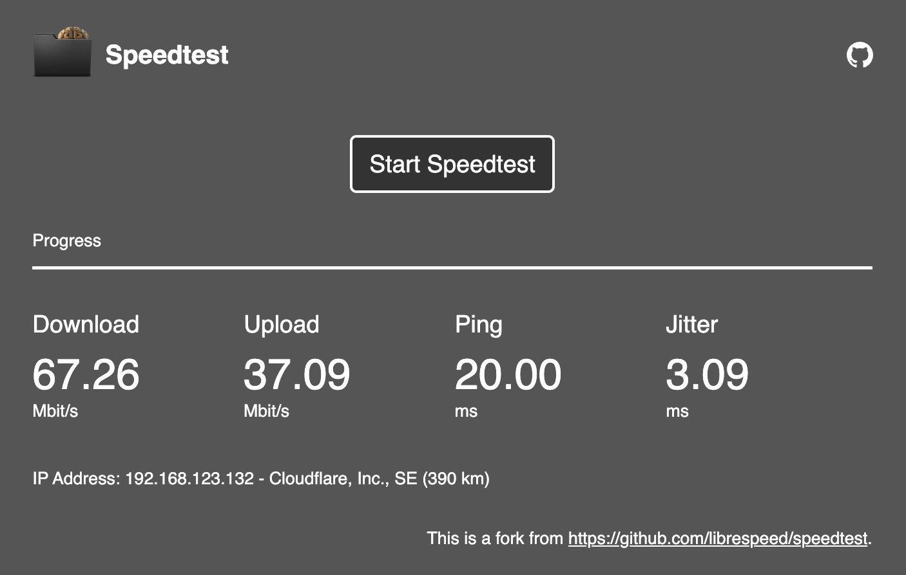

# Speedtest

## Introduction
Speedtest is a free and open source speed test that you can host on your server and users can run in their browser. This is a fork from [https://github.com/librespeed/speedtest](https://github.com/librespeed/speedtest).



### Features
* Download test
* Upload test
* Ping and Jitter test
* IP address, ISP and distance detection

#### Browser support
The test supports any browser that supports XHR Level 2 and Web Workers. JavaScript must be enabled.

The following browsers are tested:
* Google Chrome and other Chromium-based browsers
* Microsoft Edge
* Apple Safari
* Mozilla Firefox
* Opera
* Internet Explorer 11
* works with mobile versions too

Client side, the test can use up to 500MB of RAM on very fast connections.

## Table of contents
* [Introduction](#introduction)
  + [Features](#features)
    - [Browser support](#browser-support)
* [Installation](#installation)
  + [ipinfo.io](#ipinfoio)
* [Documentation](#documentation)
  + [Initialization](#initialization)
  + [Event handlers](#event-handlers)
  + [Test parameters](#test-parameters)
  + [Running the test](#running-the-test)
* [Implementation details](#implementation-details)
  + [speedtest.js](#speedtestjs)
    - [List of functions in the Speedtest class](#list-of-functions-in-the-speedtest-class)
  + [speedtest_worker.js](#speedtest_workerjs)
    - [Parameters](#parameters)
    - [Download test](#download-test)
    - [Upload test](#upload-test)
    - [Ping + Jitter test](#ping--jitter-test)
  + [backend files](#backend-files)
    - [garbage.php](#garbagephp)
    - [empty.php](#emptyphp)
    - [getIP.php](#getipphp)
    - [CORS headers](#cors-headers)
* [Alternative backends](#alternative-backends)
  + [Replacement for garbage.php](#replacement-for-garbagephp)
  + [Replacement for empty.php](#replacement-for-emptyphp)
  + [Replacement for getIP.php](#replacement-for-getipphp)
  + [No backend](#no-backend)
* [Troubleshooting](#troubleshooting)
* [Known bugs and limitations](#known-bugs-and-limitations)
  + [General](#general)
  + [IE specific](#ie-specific)
  + [Firefox specific](#firefox-specific)
* [License](#license)

## Installation

Server side, you'll need:
* Apache 2 (nginx and IIS also supported). A fast internet connection is required (possibly gigabit), and the web server must accept large POST requests (up to 20MB)
* PHP 5.4 or newer, a 64-bit version is strongly recommended
* OpenSSL and its PHP module (this is usually installed automatically by most distros)

Let's install the speed test.

Put all files on your web server via FTP, by copying them directly or with `git clone https://github.com/SimpelMe/speedtest`. You can install it in the root, or in a subdirectory.

__Important:__ The speed test needs write permissions in the installation folder.

Then open `index.php` and remove two lines. Because those embed my personal website header and you don't have this code.

First remove in `<head>`:

```
<?php include dirname($_SERVER['DOCUMENT_ROOT']) . "/simpel.cc/php/head.php"; ?>
```

Second remove in `<header>`:

```
<?php include dirname($_SERVER['DOCUMENT_ROOT']) . "/simpel.cc/php/header.php"; ?>
```

### ipinfo.io
The speed test uses [ipinfo.io](https://ipinfo.io) to detect ISP and distance from server. This is completely optional and can be disabled if you want (see speed test settings), but it is enabled by default, and if you expect more than ~500 tests per day, you will need to sign up to [ipinfo.io](https://ipinfo.io) and edit `backend/getIP_ipInfo_apikey.php` to set your access token.

## Documentation
This section explains how to use speedtest.js in your webpages.

### Initialization
To use the speed test in your page, first you need to load it:
```xml
<script type="text/javascript" src="speedtest.js"></script>
```

After loading, you can initialize the test:
```js
var s=new Speedtest();
```

### Event handlers
Now, you can set up event handlers to update your UI:
```js
s.onupdate=function(data){
    //update your UI here
}
s.onend=function(aborted){
    //end of the test
    if(aborted){
        //something to do if the test was aborted instead of ending normally
    }
}
```

The `onupdate` event handler will be called periodically by the test with data coming from the speed test worker thread. The `data` argument is an object containing the following:
* __testState__: an integer between -1 and 5
    * `-1` = Test not started yet
    * `0` = Test starting
    * `1` = Download test in progress
    * `2` = Ping + Jitter test in progress
    * `3` = Upload test in progress
    * `4` = Test finished
    * `5` = Test aborted
* __dlStatus__: either
    * Empty string (not started or aborted)
    * Download speed in Megabit/s as a number with 2 decimals
    * The string "Fail" (test failed)
* __ulStatus__: either
    * Empty string (not started or aborted)
    * Upload speed in Megabit/s as a number with 2 decimals
    * The string "Fail" (test failed)
* __pingStatus__: either
    * Empty string (not started or aborted)
    * Estimated ping in milliseconds as a number with 2 decimals
    * The string "Fail" (test failed)
* __clientIp__: either
    * Empty string (not fetched yet or failed)
    * The client's IP address as a string (with ISP info if enabled)
* __jitterStatus__: either
    * Empty string (not started or aborted)
    * Estimated jitter in milliseconds as a number with 2 decimals (lower = stable connection)
    * The string "Fail" (test failed)
* __dlProgress__: the progress of the download test as a number between 0 and 1
* __ulProgress__: the progress of the upload test as a number between 0 and 1
* __pingProgress__: the progress of the ping+jitter test as a number between 0 and 1

The `onend` event handler will be called at the end of the test (`onupdate` will be called first), with a boolean telling you if the test was aborted (either manually or because of an error) or if it ended normally.

### Test parameters
Before starting the test, you can change some of the settings from their default values. You might want to do this to better adapt the speed test to a specific scenario, such as a satellite connection. To change a setting, use
```js
s.setParameter("parameter_name",value);
```

For instance, to enable telemetry we can use:
```js
s.setParameter("telemetry_level","basic");
```
And now the test results will be stored and we will get our test ID at the end of the test (along with the other data)

__Main parameters:__
* __time_dl_max__: Maximum duration of the download test in seconds. If auto duration is disabled, this is used as the duration of the test.
    * Default: `15`
    * Recommended: `>=5`
* __time_ul_max__: Maximum duration of the upload test in seconds. If auto duration is disabled, this is used as the duration of the test.
    * Default: `15`
    * Recommended: `>=10`
* __time_auto__: Automatically determine the duration of the download and upload tests, making them faster on faster connections, to avoid wasting data.
    * Default: `true`
* __count_ping__: How many pings to perform in the ping test
    * Default: `10`
    * Recommended: `>=3, <30`
* __url_dl__: path to garbage.php or a large file to use for the download test.
    * Default: `garbage.php`
    * __Important:__ path is relative to js file
* __url_ul__: path to an empty file or empty.php to use for the upload test
    * Default: `empty.php`
    * __Important:__ path is relative to js file
* __url_ping__: path to an empty file or empty.php to use for the ping test
    * Default: `empty.php`
    * __Important:__ path is relative to js file
* __url_getIp__: path to getIP.php or replacement
    * Default: `getIP.php`
    * __Important:__ path is relative to js file
* __url_telemetry__: path to telemetry.php or replacement (disabled - to use telemetry see original source where this is forked from)
    * Default: `results/telemetry.php`
    * __Important:__ path is relative to js file
	* __Note:__ you can ignore this parameter if you're not using the telemetry
* __telemetry_level__: The type of telemetry to use. See the telemetry section for more info about this
	* Default: `none`
	* `basic`: send results only
	* `full`: send results and timing information, even for aborted tests
	* `debug`: same as full but also sends debug information. Not recommended.
* __test_order__: the order in which tests will be performed. You can use this to change the order of the test, or to only enable specific tests. Each character represents an operation:
    * `I`: get IP
    * `D`: download test
    * `U`: upload test
    * `P`: ping + jitter test
    * `_`: delay 1 second
    * Default test order: `IP_D_U`
    * __Important:__ Tests can only be run once
    * __Important:__ On Firefox, it is better to run the upload test last
* __getIp_ispInfo__: if true, the server will try to get ISP info and pass it along with the IP address. This will add `isp=true` to the request to `url_getIp`. getIP.php accomplishes this using ipinfo.io
    * Default: `true`
* __getIp_ispInfo_distance__: if true, the server will try to get an estimate of the distance from the client to the speed test server. This will add a `distance` argument to the request to `url_getIp`. `__getIp_ispInfo__` must be enabled in order for this to work. getIP.php accomplishes this using ipinfo.io
    * `km`: estimate distance in kilometers
    * `mi`: estimate distance in miles
    * not set: do not measure distance
    * Default: `km`

__Advanced parameters:__ (Seriously, don't change these unless you know what you're doing)
* __telemetry_extra__: Extra data that you want to be passed to the telemetry. This is a string field, if you want to pass an object, make sure you use ``JSON.stringify``. This string will be added to the database entry for this test.
* __enable_quirks__: enables browser-specific optimizations. These optimizations override some of the default settings. They do not override settings that are explicitly set.
    * Default: `true`
* __garbagePhp_chunkSize__: size of chunks sent by garbage.php in megabytes
    * Default: `100`
    * Recommended: `>=10`
    * Maximum: `1024`
* __xhr_dlMultistream__: how many streams should be opened for the download test
    * Default: `6`
    * Recommended: `>=3`
    * Default override: 3 on Edge if enable_quirks is true
    * Default override: 5 on Chromium-based if enable_quirks is true
* __xhr_ulMultistream__: how many streams should be opened for the upload test
    * Default: `3`
    * Recommended: `>=1`
* __xhr_ul_blob_megabytes__: size in megabytes of the blobs sent during the upload test
	* Default: `20`
	* Default override: 4 on Chromium-based mobile browsers (limitation introduced around version 65). This will be forced
	* Default override: IE11 and Edge currently use a different method for the upload test. This parameter is ignored
* __xhr_multistreamDelay__: how long should the multiple streams be delayed (in ms)
    * Default: `300`
    * Recommended: `>=100`, `<=700`
* __xhr_ignoreErrors__: how to react to errors in download/upload streams and the ping test
    * `0`: Fail test on error (behaviour of previous versions of this test)
    * `1`: Restart a stream/ping when it fails
    * `2`: Ignore all errors
    * Default: `1`
    * Recommended: `1`
* __time_dlGraceTime__: How long to wait (in seconds) before actually measuring the download speed. This is a good idea because we want to wait for the TCP window to be at its maximum (or close to it)
    * Default: `1.5`
    * Recommended: `>=0`
* __time_ulGraceTime__: How long to wait (in seconds) before actually measuring the upload speed. This is a good idea because we want to wait for the buffers to be full (avoids the peak at the beginning of the test)
    * Default: `3`
    * Recommended: `>=1`
* __ping_allowPerformanceApi__: toggles use of Performance API to improve accuracy of Ping/Jitter test on browsers that support it.
	* Default: `true`
	* Default override: `false` on Firefox because its performance API implementation is inaccurate
* __useMebibits__: use mebibits/s instead of megabits/s for the speeds
	* Default: `false`
* __overheadCompensationFactor__: compensation for HTTP and network overhead. Default value assumes typical MTUs used over the Internet. You might want to change this if you're using this in your internal network with different MTUs, or if you're using IPv6 instead of IPv4.
    * Default: `1.06` probably a decent estimate for all overhead. This was measured empirically by comparing the measured speed and the speed reported by my the network adapter.
    * `1048576/925000`: old default value. This is probably too high.
	* `1.0513`: HTTP+TCP+IPv6+ETH, over the Internet (empirically tested, not calculated)
    * `1.0369`: Alternative value for HTTP+TCP+IPv4+ETH, over the Internet (empirically tested, not calculated)
	* `1.081`: Yet another alternative value for over the Internet (empirically tested, not calculated)
    * `1514 / 1460`: TCP+IPv4+ETH, ignoring HTTP overhead
    * `1514 / 1440`: TCP+IPv6+ETH, ignoring HTTP overhead
    * `1`: ignore overheads. This measures the speed at which you actually download and upload files rather than the raw connection speed

### Running the test
Finally, we can run the test:
```js
s.start();
```
During the test, your `onupdate` event handler will be called periodically with data that you can use to update your UI. Your `onend` handler will be called at the end of the test.

You can abort the test at any time:
```js
s.abort();
```

When the test is finished, you can run it again if you want, or you can just destroy `s`.

## Implementation details
The purpose of this section is to help developers who want to make changes to the inner workings of the speed test.  
It will be divided into 4 sections: `speedtest.js`, `speedtest_worker.js` and the `backend` files.

### speedtest.js
This is the main interface between your webpage and the speed test.
It hides the speed test web worker to the page, and provides many convenient functions to control the test.

You can think of this as a finite state machine. These are the states (use getState() to see them):
* __0__: here you can change the speed test settings (such as test duration) with the `setParameter("parameter",value)` function. From here you can either start the test using `start()` (goes to state 3) or you can add multiple test points using `addTestPoint(server)` or `addTestPoints(serverList)` (goes to state 1). Additionally, this is the perfect moment to set up callbacks for the `onupdate(data)` and `onend(aborted)` events.
* __1__: here you can add test points. You only need to do this if you want to use multiple test points.
    A server is defined as an object like this:
    ```
    {
        name: "User friendly name",
        server:"http://yourBackend.com/",     <---- URL to your server. You can specify http:// or https://. If your server supports both, just write // without the protocol
        dlURL:"garbage.php"    <----- path to garbage.php or its replacement on the server
        ulURL:"empty.php"    <----- path to empty.php or its replacement on the server
        pingURL:"empty.php"    <----- path to empty.php or its replacement on the server. This is used to ping the server by this selector
        getIpURL:"getIP.php"    <----- path to getIP.php or its replacement on the server
    }
    ```
    While in state 1, you can only add test points, you cannot change the test settings. When you're done, use selectServer(callback) to select the test point with the lowest ping. This is asynchronous, when it's done, it will call your callback function and move to state 2. Calling setSelectedServer(server) will manually select a server and move to state 2.
* __2__: test point selected, ready to start the test. Use `start()` to begin, this will move to state 3
* __3__: test running. Here, your `onupdate` event calback will be called periodically, with data coming from the worker about speed and progress. A data object will be passed to your `onupdate` function, with the following items:
        - `dlStatus`: download speed in mbps
        - `ulStatus`: upload speed in mbps
        - `pingStatus`: ping in ms
        - `jitterStatus`: jitter in ms
        - `dlProgress`: progress of the download test as a float 0-1
        - `ulProgress`: progress of the upload test as a float 0-1
        - `pingProgress`: progress of the ping/jitter test as a float 0-1
        - `testState`: state of the test (-1=not started, 0=starting, 1=download test, 2=ping+jitter test, 3=upload test, 4=finished, 5=aborted)
        - `clientIp`: IP address of the client performing the test (and optionally ISP and distance)
    At the end of the test, the `onend` function will be called, with a boolean specifying whether the test was aborted or if it ended normally.
    The test can be aborted at any time with `abort()`.
    At the end of the test, it will move to state 4
* __4__: test finished. You can run it again by calling `start()` if you want.

#### List of functions in the Speedtest class

##### getState()
Returns the state of the test: 0=adding settings, 1=adding servers, 2=server selection done, 3=test running, 4=done

##### setParameter(parameter,value)
Change one of the test settings from their defaults.
- parameter: string with the name of the parameter that you want to set
- value: new value for the parameter

Invalid values or nonexistant parameters will be ignored by the speed test worker.

##### addTestPoint(server)
Add a test point (multiple points of test)
- server: the server to be added as an object. Must contain the following elements:
    ```
    {
        name: "User friendly name",
        server:"http://yourBackend.com/",   URL to your server. You can specify http:// or https://. If your server supports both, just write // without the protocol
        dlURL:"garbage.php"   path to garbage.php or its replacement on the server
        ulURL:"empty.php"   path to empty.php or its replacement on the server
        pingURL:"empty.php"   path to empty.php or its replacement on the server. This is used to ping the server by this selector
        getIpURL:"getIP.php"   path to getIP.php or its replacement on the server
    }
    ```

Note that this will add `mpot`:`true` to the parameters sent to the speed test worker.

##### addTestPoints(list)
Same as addTestPoint, but you can pass an array of servers

##### loadServerList(url,result)
Loads a list of servers from a JSON file pointed by the `url`.

The process is asynchronous and the `result` function will be called when it's done. If the request succeeded, an array containing the list of loaded servers will be passed to the function, otherwise `null` will be passed.

##### getSelectedServer()
Returns the selected server (multiple points of test)

##### setSelectedServer()
Manually selects one of the test points (multiple points of test)

##### selectServer(result)
Automatically selects a server from the list of added test points. The server with the lowest ping will be chosen. (multiple points of test)

The selector checks multiple servers in parallel (default: 6 streams) to speed things up if the list of servers is long.

The process is asynchronous and the passed `result` callback function will be called when it's done, then the test can be started.

##### start()
Starts the test.

Note (multiple points of test): the selected server will be added to the `telemetry_extra` string. If this string was already set, then `telemetry_extra` will be a JSON string containing both the server and the original string

During the test, the `onupdate(data)` callback function will be called periodically with data from the worker.  
At the end of the test, the `onend(aborted)` function will be called with a boolean telling you if the test was aborted or if it ended normally.

##### abort()
Aborts the test while it's running.

### speedtest_worker.js
This is where the actual speed test code is. It receives the settings from the main thread, runs the test, and reports back the results.

The worker accepts 3 commands:
* `start`: starts the test. Optionally, test settings can be passed as a JSON string after the word start and a space
* `status`: returns the current status as a JSON string. The status string contents are the ones described in the Event handlers section in the section about making a custom front-end.
* `abort`: aborts the test

#### Parameters
In addition to the parameters listed in the Test settings section in the section about making a custom front-end, there is one additional setting:
* `mpot`: set this to true to run the test with multiple points of test. This will add `cors=true` to all requests (all responses will contain CORS headers) and enable some extra quirks.
    Default: `false`

#### Download test
The download test is performed by transferring large blobs of garbage data using XHR from the server to the client.

The test uses multiple streams. If a stream finishes the download, it is restarted. The amount of downloaded data for each stream is tracked using the XHR Level 2 `onprogress` event.

The test streams are not perfectly synchronized because we don't want them to finish all at the same time if they do.

Every 200ms, a timer updates the `dlStatus` string with the current speed and calculates a "bonus" time by which to shorten the test depending on how high the speed is, (when `time_auto` is set to `true`).

See the code for more implementation details.

#### Upload test
This works similarly to the download test, but in reverse. A large blob of garbage data is generated and it is sent to the server repeatedly using multiple streams.

To keep track of the amount of transferred data, the XHR Level 2 `upload.onprogress` event is used.

This test has a couple of complications:
* Some browsers don't have a working `upload.onprogress` event. For this, we use a small blobs instead of a large one and we keep track of progress using the `onload` event. This is referred to as IE11 Workaround (but the same bug was also found in some versions of Edge and Safari)
* When `mpot` is set to `true`, an empty request must first be sent in order to load the CORS headers before the test can start

See the code for more implementation details.

#### Ping + Jitter test
The Ping/Jitter test __is NOT an ICMP ping__. This is a common misconception. You cannot use ICMP over HTTP, and certainly not in a browser.

This test works by creating a persistent HTTP connection to the server, and then repeatedly downloading an empty file, and measuring how long it takes between the request and the response.

Timing can be measured as a simple timestamp difference or with the Performance API if available.

Jitter is the variance in ping times.

See the code for more implementation details.

### backend files
#### garbage.php
Uses OpenSSL to generate a stream of incompressible garbage data for the download test.

If accepts a `ckSize` GET parameter, which specifies how much garbage data to generate in megabytes (4-1024).

#### empty.php
An empty file used for the upload and ping test. It only sends headers to create the connection.

#### getIP.php
Returns client IP, ISP and distance from the server.

GET parameters:
* `isp`: if set, fetches ISP info from ipinfo.io
* `distance`: if set, calculates distance from server. You can specify `km` or `mi` for the format.

If `isp` is set, the output is a JSON string containing:
* `processedString`: string that can be displayed to the user
* `rawIspInfo`: info about the client as a JSON string, straight from ipinfo.io

If `isp` is not set, the output is just a string containing the client's IP address.

Note: if your server is behind some proxy, firewall, VPN, etc., the client's IP address may not be detected properly. If this happens, you must analyze the traffic coming from the client to find the name of the HTTP header that contains the original IP address. `getIP.php` contains some of these headers but not all of them.

#### CORS headers
All these files will send the following CORS headers if the GET parameter `cors=true` is passed to them:
```
Access-Control-Allow-Origin: *
Access-Control-Allow-Methods: GET, POST
Access-Control-Allow-Headers: Content-Encoding, Content-Type
```

## Alternative backends
If for some reason you can't or don't want to use PHP, the speed test can run with other backends, or even no backend (with limited functionality).

You will need replacements for `backend/garbage.php` and `backend/empty.php` and optionally `backend/getIP.php`, and the test needs to know where to find them:
```js
//Speed test initialization
var s=new Speedtest();
...
//Custom backend
s.setParameter("url_dl","URL to your garbage.php replacement");
s.setParameter("url_ul","URL to your empty.php replacement");
s.setParameter("url_ping","URL to your empty.php replacement");
s.setParameter("url_getIp","URL to your getIP.php replacement");
```

### Replacement for garbage.php
A replacement for `garbage.php` must generate incompressible garbage data.

A large file (10-100 Mbytes) is a possible replacement. You can get one [here](http://downloads.fdossena.com/geth.php?r=speedtest-bigfile).

A symlink to `/dev/urandom` is also ok.

If you want to make your own backend, see the section on the implementation details of `garbage.php`.

### Replacement for empty.php
Your replacement must simply respond with a HTTP code 200 and send nothing else. You may want to send additional headers to disable caching. The test assumes that `Connection:keep-alive` is sent by the server.

An empty file can be used for this.

If you want to make your own backend, see the section on the implementation details of `empty.php`.

### Replacement for getIP.php
Your replacement can simply respond with the client's IP as plaintext or do something more fancy.

If you want to make your own backend, see the section on the implementation details of `getIP.php`.

### No backend
The speed test can run, albeit with limited functionality, using only a web server as backend, with no PHP or other server-side scripting.

You will be able to run the download and upload test, but no IP, ISP and distance detection, no telemetry and results sharing, and only a single point of test.

To do this, you will need:
* A replacement for `garbage.php`: a large incompressible file, like [this](http://downloads.fdossena.com/geth.php?r=speedtest-bigfile). We'll call this `backend/garbage.dat`
* A replacement for `empty.php`: an empty file will do. We'll call this `backend/empty.dat`

Now you need to configure the test to use them. Look for `s=new Speedtest()` and right below it, put the following:
```js
s.setParameter("url_dl","backend/garbage.dat");
s.setParameter("url_ul","backend/empty.dat");
s.setParameter("url_ping","backend/empty.dat");
s.setParameter("test_order","P_D_U");
```

This will point to our static files and set the test to only do ping/jitter, download and uplod tests.

## Troubleshooting
These are the most common issues reported by users, and how to fix them.

### Download test gives very low result
Are garbage.php and empty.php (or your replacements) reachable?  
Press F12, select network and start the test. Do you see errors? (Cancelled requests are not errors.)  
If a small download starts, open it in a text editor. Does it say it's missing openssl_random_pseudo_bytes()? In this case, install OpenSSL (this is usually included when you install Apache and PHP on most distros).

### Upload test is inaccurate, and/or I see lag spikes
Check your server's maximum POST size, make sure it's at least 20Mbytes, possibly more

### Download and/or upload results are slightly too optimistic
The test was fine tuned to run over a typical IPv4 internet connection. If you're using it under different conditions, see the `overheadCompensationFactor` parameter.

### All tests are wrong, give extremely high results, browser lags/crashes ...
You're running the test on localhost, therefore it is trying to measure the speed of your loopback interface. The test is meant to be run over an Internet connection, from a different machine.

### Ping test shows double the actual ping
Make sure your server is sending the `Connection:keep-alive` header

### The server is behind a load balancer, proxy, etc. and I get the wrong IP address
Edit getIP.php and replace lines 14-23 with what is more appropriate in your scenario.  
Example: `$ip = $_SERVER['HTTP_X_FORWARDED_FOR'];`

### My server is behind Cloudflare and I can't reach full speed on some of the tests
This is not a speed test related issue, as it can be replicated in virtually any HTTP file upload/download.  
Go to your domain's DNS settings and change "DNS and HTTP proxy (CDN)" to "DNS only", and wait for the settings to be applied (can take a few minutes).

### On Windows Server, using IIS, the upload test doesn't work, CORS errors are visible in the console
This is a configuration issue. Make a file called web.config in wwwroot and adapt the following code:
```xml
<?xml version="1.0" encoding="UTF-8"?>
<configuration>
  <system.webServer>
    <cors enabled="true" failUnlistedOrigins="false">
      <add origin="*">
        <allowHeaders allowAllRequestedHeaders="true" />
        <allowMethods>
          <add method="GET" />
          <add method="POST" />
          <add method="PUT" />
          <add method="DELETE" />
          <add method="OPTIONS" />
        </allowMethods>
        <exposeHeaders>
        </exposeHeaders>
      </add>
    </cors>
  </system.webServer>
</configuration>
```

## Known bugs and limitations
### General
* The ping/jitter test is measured by seeing how long it takes for an empty XHR to complete. It is not an acutal ICMP ping. Different browsers may also show different results, especially on very fast connections on slow devices.
### IE specific
* The upload test is not precise on very fast connections with high latency (will probably be fixed by Edge 17)
* On IE11, a same origin policy error is erroneously triggered under unknown conditions. Seems to be related to running the test from unusual URLs like a top level domain (for instance http://abc/speedtest). These are bugs in IE11's implementation of the same origin policy, not in the speed test itself.
* On IE11, under unknown circumstances, on some systems the test can only be run once, after which speedtest_worker.js will not be loaded by IE until the browser is restarted. This is a rare bug in IE11.
### Firefox specific
* On some Linux systems with hardware acceleration turned off, the page rendering makes the browser lag, reducing the accuracy of the ping/jitter test, and potentially even the download and upload tests on very fast connections.

## License
This software is under the GNU LGPL license, Version 3 or newer.

To put it short: you are free to use, study, modify, and redistribute this software and modified versions of it, for free or for money.
You can also use it in proprietary software but all changes to this software must remain under the same GNU LGPL license.

Copyright (C) 2016-2022 Federico Dossena, modified by Simpel

This program is free software: you can redistribute it and/or modify
it under the terms of the GNU Lesser General Public License as published by
the Free Software Foundation, either version 3 of the License, or
(at your option) any later version.

This program is distributed in the hope that it will be useful,
but WITHOUT ANY WARRANTY; without even the implied warranty of
MERCHANTABILITY or FITNESS FOR A PARTICULAR PURPOSE.  See the
GNU General Public License for more details.

You should have received a copy of the GNU Lesser General Public License
along with this program.  If not, see <https://www.gnu.org/licenses/lgpl>.
